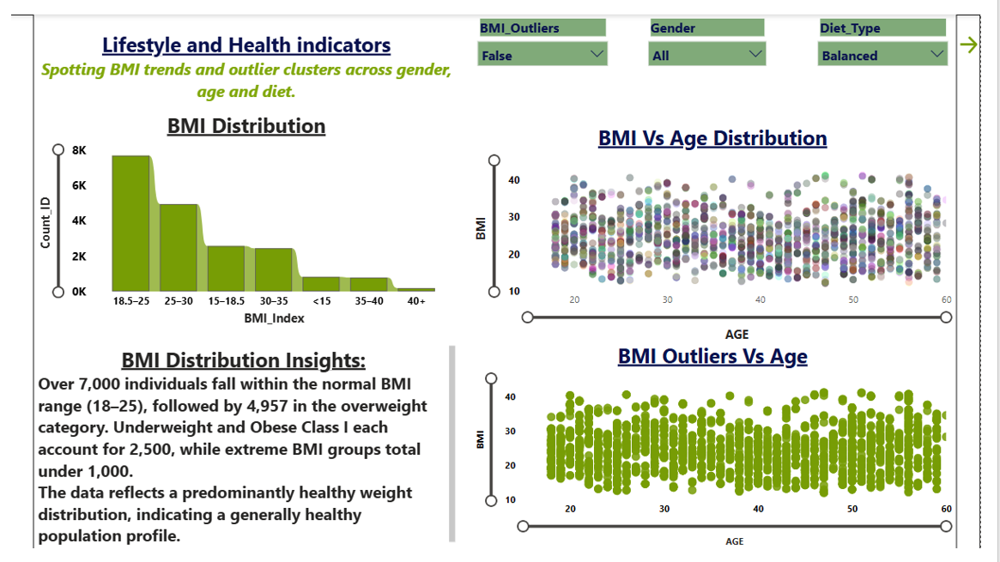
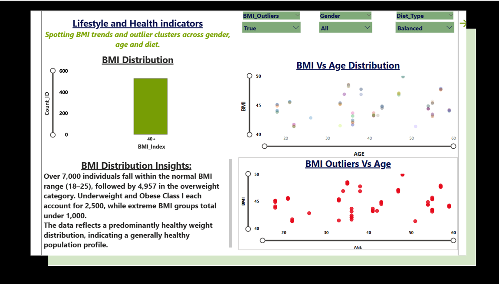
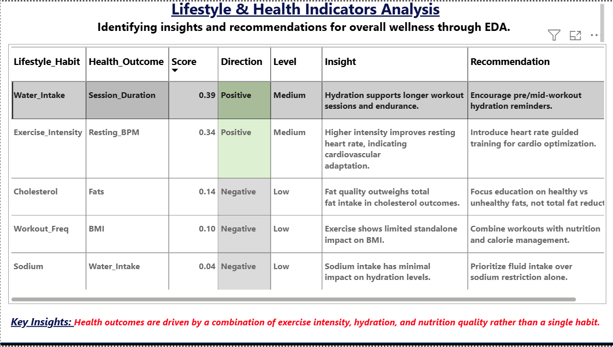
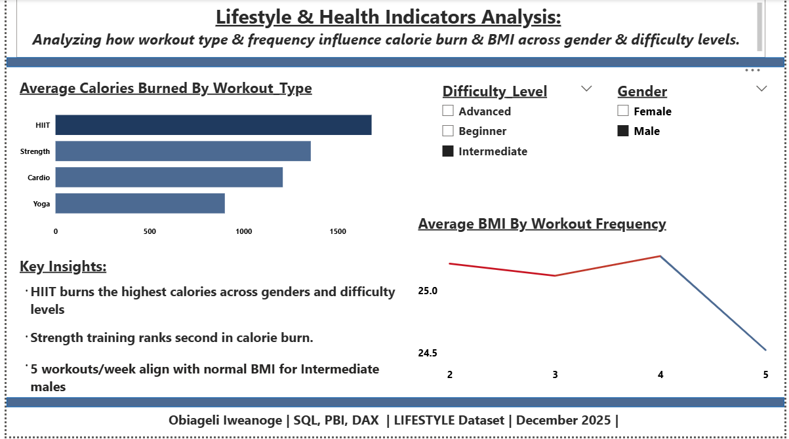

# 📊 Lifestyle & Health Analysis Project

> Uncovering hidden patterns and outliers in lifestyle data using PostgreSQL and Power BI.

---

## 🧭 About This Project

This project was born out of a curiosity about how everyday lifestyle choices — diet, workout habits, and activity levels — connect to measurable health outcomes like BMI. Using a real-world lifestyle dataset, the goal was to go beyond surface-level averages and identify the outliers: individuals whose patterns stand out and may signal unique habits or potential health risks.

---

## 📌 Overview

This analysis explores demographic and lifestyle drivers including BMI, age, gender, workout experience, and diet type. Key questions investigated:

- Which demographic groups fall outside healthy BMI ranges?
- Is there a correlation between workout frequency and BMI outliers?
- How does diet type influence health scores across age groups?

**Key Finding:** Analysis revealed that a significant portion of individuals fell outside healthy BMI ranges, with diet type and workout experience showing the strongest correlations.

---

## 📊 Dashboard Previews

### BMI Dashboard

### BMI Outliers

### Correlation Coefficient Dashboard

### Health Scores Dashboard

---
## 🗂️ Project Structure

- 📁 `data/` → raw and cleaned datasets
- 📁 `sql/` → SQL scripts for queries and transformations
- 📁 `dashboards/` → Power BI dashboard screenshots
- 📁 `docs/` → documentation and notes
- 📄 `README.md`
  
---
## 🛠️ Tools & Skills

| Tool | Purpose |
|---|---|
| **PostgreSQL** | Data cleaning, schema alignment, outlier queries |
| **Power BI** | Interactive dashboards and visual storytelling |
| **Excel** | Quick checks, formatting, and data validation |
| **GitHub** | Version control and project sharing |

---

## 💡 Insights & Key Findings

- Individuals with **inconsistent workout schedules** showed higher rates of BMI outliers
- **Diet type** was a stronger predictor of BMI range than age or gender
- Outliers were not evenly distributed — certain age groups showed clustering outside healthy ranges

---

## 🚀 How to Use

1. Clone the repository:
2. Explore the `data/` folder for the raw dataset
3. Review SQL scripts in the `sql/` folder
4. Open Power BI dashboard files in the `dashboards/` folder

---

## 👩‍💻 About Me

Aspiring Data Analyst passionate about using data visualization and 
analytics to uncover insights that support health-focused and social 
impact initiatives. Skilled in PostgreSQL, Power BI, and Excel. 
Open to collaboration and feedback.

🔗 GitHub: [github.com/Obiageli-E](https://github.com/Obiageli-E)

